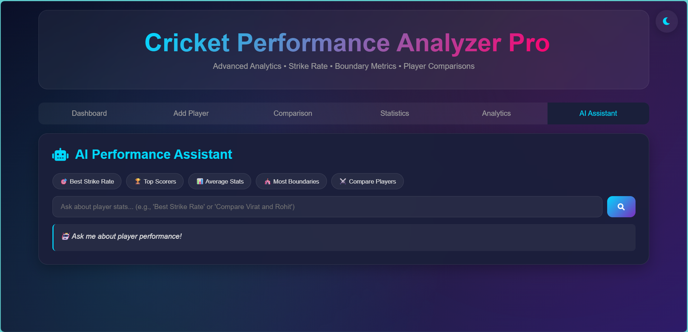

# 🏏 Cricket Performance Analyzer

A web-based application to track, analyze, and compare cricket players' statistics using strike rate and boundary metrics. Built with HTML, CSS, and JavaScript, this tool offers interactive charts, AI assistant queries, and CSV import/export functionalities.

---

## 🚀 Features

- **Player Management**: Add, edit, and delete player statistics.
- **Automatic Calculations**: Strike rate and boundary percentages computed in real-time.
- **Advanced Filtering**: Filter players by name, match type (T20, ODI, Test), and team.
- **Sorting Options**: Sort players by runs, strike rate, or boundaries.
- **Data Import/Export**: Import player data from and export to CSV files.
- **Analytics Dashboard**: Visualize top run scorers, strike rate comparisons, and boundary statistics.
- **Player Comparison**: Compare statistics between two players.
- **AI Assistant**: Query player statistics using natural language.
- **Theme Toggle**: Switch between light and dark themes.

---

## 📸 Screenshots

  
*Dashboard View*

  
*Add Player View*

  
*Comparison View*

  
*Statistics View*

  
*Analytics View*

  
*AI Assistant View*


## 💻 Installation

1. Clone the repository:

   ```bash
   git clone https://github.com/charan-kumar99/Cricket-Performance-Analyzer.git


Navigate into the project directory:

cd Cricket-Performance-Analyzer

Open index.html in your browser to start using the application.

🛠 Usage

Add a Player: Use the form to input player statistics.

View Statistics: Navigate to the Statistics tab to see player data.

Analyze Performance: Access the Analytics tab for interactive charts.

Compare Players: Use the Comparison tab to compare two players.

AI Assistant: Ask questions like:

“Who has the best strike rate?”

“Top 5 run scorers”

“Most boundaries”

“Compare [player1] and [player2]”

“Team [name] stats”

Import/Export Data: Manage player data via CSV files.

Toggle Theme: Switch between light and dark modes.

📊 AI Assistant Commands

Who has the best strike rate?

Top 5 run scorers

Average runs

Most boundaries

Compare [player1] and [player2]

Team [name] stats

📂 Project Structure
Cricket-Performance-Analyzer/
│
├── index.html        # Main HTML file
├── script.js         # JavaScript logic
├── style.css         # CSS styling
├── players.csv       # Sample player data
└── assets/           # Screenshots and images


⚙️ Technologies Used

HTML5 – Structure and content of web pages

CSS3 – Styling and layout design

JavaScript (ES6) – Interactivity and dynamic content

Chart.js – Interactive charts for analytics

LocalStorage – Persistent player data across sessions


🔗 Contributing

Contributions are welcome! To contribute:

Fork the repository.

Create a new branch:

git checkout -b feature/YourFeature


Commit your changes:

git commit -m "Add your feature"


Push to the branch:

git push origin feature/YourFeature


Open a Pull Request.


📬 Contact

Email: charansuvarna99@gmail.com

GitHub: https://github.com/charan-kumar99